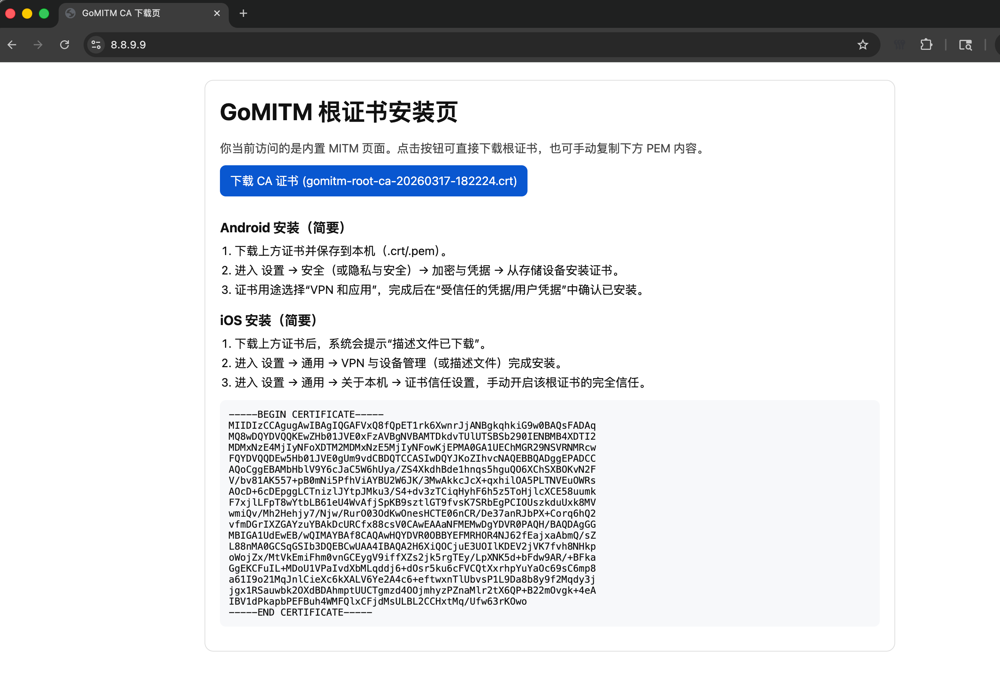

# gomitm

> 一句话：用 Go 构建的高性能 SOCKS5 MITM 代理，开箱即用支持根证书下载页、模块化脚本和 HAR 导出。



## 为什么值得用

- 5 分钟跑通：启动后直接访问 [http://8.8.9.9/](http://8.8.9.9/) 下载并安装 CA
- 兼顾调试与分析：实时抓包 + HAR 导出，且保留上游原始响应与最终响应
- 规则迁移成本低：支持 Surge-like 模块子集（MITM / URL Rewrite / Script）

`gomitm` 是一个高性能 SOCKS5 MITM 代理，目标是把“路由能力 + HTTPS 解密 + 模块化脚本处理 + 抓包导出”整合到一个可扩展的 Go 工具里。

项目现阶段聚焦：

1. 稳定的 SOCKS5 入站与 HTTPS MITM 主链路
2. Surge-like 模块子集兼容（规则/脚本）
3. 面向调试与分析的抓包能力（含 HAR 导出）

开发规范见 [docs/ARCHITECTURE.zh-CN.md](./docs/ARCHITECTURE.zh-CN.md)。

## Features

- SOCKS5 入口（`NO AUTH` + `CONNECT`）
- MITM 策略：
  - 按域名列表（`mitm.hosts` / `--mitm-hosts`）
  - 全量 443（`mitm.all` / `--mitm-all`）
  - 内置证书安装页流量保底可 MITM（便于首次安装 CA）
- HTTPS MITM（HTTP/1.1）+ 动态证书签发
- CA 管理：
  - 首次启动自动生成 Root CA
  - 命令行导出证书
  - 内置证书下载页面
- 模块引擎（Surge-like 子集）：
  - `[MITM] hostname`
  - `[URL Rewrite] ... - reject / reject-200`
  - `[Script]`（`http-request` / `http-response`）
  - `binary-body-mode=true`（`bodyBytes`）
- 抓包能力：
  - Admin API 实时查看
  - 导出 HAR
  - 同时记录上游原始响应与最终响应（含 `RespModified`）
- 发布产物包含默认 `config.yaml` 与本地 `modules/`

## Quick Start

如果你不想本地编译，也可以直接下载预编译发布包：

- GitHub Releases: <https://github.com/ygcaicn/gomitm/releases>

## 适用环境

- 源码构建：Go `1.22+`
- 预编译发布包：Linux / macOS / Windows（amd64 / arm64）
- OpenWrt 预编译发布包：`amd64` / `armv7` / `arm64` / `mips softfloat` / `mipsle softfloat`
  - 资产命名示例：`gomitm_vX.Y.Z_openwrt_mipsle_softfloat.tar.gz`

## 一键安装（Linux）

仅支持主流 Linux 发行版（Debian/Ubuntu、RHEL 系、Fedora、Arch、openSUSE）且要求 `systemd`。

安装路径遵循 FHS：

- Binary: `/usr/local/bin/gomitm`
- Config: `/etc/gomitm/config.yaml`
- Modules: `/usr/local/share/gomitm/modules/`
- Runtime/Data: `/var/lib/gomitm`
- systemd unit: `/etc/systemd/system/gomitm.service`

```bash
sudo bash -c "$(curl -L https://github.com/ygcaicn/gomitm/raw/main/install-release.sh)" @ install
sudo bash -c "$(curl -L https://github.com/ygcaicn/gomitm/raw/main/install-release.sh)" @ remove
```

`remove` 只卸载服务、二进制与共享模块目录；会保留 `/etc/gomitm/config.yaml` 和 `/var/lib/gomitm/ca/*`，并打印保留项清单。
安装完成后脚本会自动执行 `gomitm version` 打印当前已安装版本。

### 1) 构建

```bash
go build -o ./gomitm ./cmd/gomitm
./gomitm version
```

### 2) 初始化并导出 CA

```bash
./gomitm ca init --ca-dir ~/.gomitm/ca
./gomitm ca export --ca-dir ~/.gomitm/ca --out ./gomitm-ca.crt
```

### 3) 启动服务

```bash
./gomitm serve --config ./config.example.yaml
```

### 4) 配置客户端代理

- SOCKS5: `127.0.0.1:1080`
- 在系统/浏览器导入并信任 `gomitm-ca.crt`
- 访问内置证书安装页前，请确保目标应用已走该 SOCKS5 代理

## Built-in Pages

- [http://8.8.9.9/](http://8.8.9.9/)
  - 用于首次引导安装根证书

## Configuration

推荐使用配置文件启动，CLI 仅做覆盖。

参考文件：[`config.example.yaml`](./config.example.yaml)

### Core Fields

- `serve.listen`: SOCKS5 监听地址
- `serve.admin_listen`: Admin API 监听地址
- `serve.ca_dir`: CA 存储目录
- `mitm.all`: 是否全量 MITM 所有 `443` 目标
- `mitm.fail_open`: MITM 失败时是否回退为直连透传
- `mitm.hosts`: 域名匹配 MITM 列表（`mitm.all=false` 时生效）
- `mitm.bypass_hosts`: 强制跳过 MITM 的域名列表（优先于 `mitm.hosts`）
- `modules[]`: 模块挂载列表
- `capture.*`: 抓包与 HAR 导出相关参数

### Module Schema

```yaml
modules:
  - name: GoogleHomeFunDemo
    enable: true
    path: "./modules/google-home-fun.sgmodule" # 也支持 https:// URL
    arguments:
      文案: "今天也要快乐摸鱼"
  - name: YouTubeWebLite
    enable: false
    path: "./modules/youtube-web-lite.sgmodule"
    arguments:
      启用页面样式清理: true
```

路径解析规则：

1. `modules[].path` 为相对路径时，相对 `config.yaml` 所在目录
2. `.sgmodule` 内 `script-path` 为相对路径时，相对该 `.sgmodule` 文件所在目录

## Demo Modules

- `GoogleHomeFunDemo`（默认开启）
  - 对 `google.com` 首页注入明显视觉标记，便于验证 MITM+脚本链路
- `YouTubeWebLite`（实验性，默认关闭）
  - 面向浏览器端 YouTube 的轻量清理规则
- `YouTubeNoAds`（默认关闭）
  - 外部远程模块示例，适用于特定 API/客户端场景
  - 远程模块来自第三方仓库，请按需自行审计脚本内容

## Admin API

- `GET /healthz`：健康检查
- `GET /api/captures?limit=100`：抓包列表
- `GET /api/captures.har`：实时 HAR 导出

## Capture Model

每条抓包记录包含两份响应视图：

1. `UpstreamResp*`：上游原始响应
2. `Resp*`：模块处理后的最终响应

并带有：

- `RespModified`: 标记是否发生响应修改

## Development

```bash
go mod tidy
go test ./...
go run ./cmd/gomitm serve --config ./config.example.yaml
```

常用测试命令：

```bash
# race
go test -race ./...

# benchmark
go test -run '^$' -bench . -benchmem ./internal/capture ./internal/module ./internal/script ./internal/server
```

## CI / Release

工作流文件：

- `.github/workflows/ci.yml`
- `.github/workflows/release.yml`

触发方式：

1. `push main` / `pull_request main`：测试 + 构建冒烟
2. `push tag v*`：交叉编译并发布 Release
   - 包含 OpenWrt 目标：`openwrt_amd64` / `openwrt_armv7` / `openwrt_arm64` / `openwrt_mips_softfloat` / `openwrt_mipsle_softfloat`
3. `workflow_dispatch`：支持手动触发发布
   - 非 tag 引用下需提供 `release_tag`（例如 `v0.1.3`）

仓库 Secret：

- GitHub: 使用内置 `GITHUB_TOKEN`（无需额外配置同名 Secret）

## Known Limits

- 当前 MITM 仅覆盖 `443` TCP 链路
- 抓包仅覆盖 MITM 的 HTTP 事务，不包含纯 TCP 透传字节流
- `mitm-all` 场景下，部分启用证书固定（pinning）的应用会主动断开（常见于系统服务）
- YouTube 网页端规则属于实验性能力，受上游结构变更影响较大

## Security & Legal

本项目用于网络调试、协议分析和授权场景下的流量审计。  
请在合法合规前提下使用，不要用于未授权的中间人监听。

## Contributing

欢迎 Issue / PR。提交前建议至少执行：

```bash
go test ./...
go test -race ./...
```

## License

见 [LICENSE](./LICENSE)。
