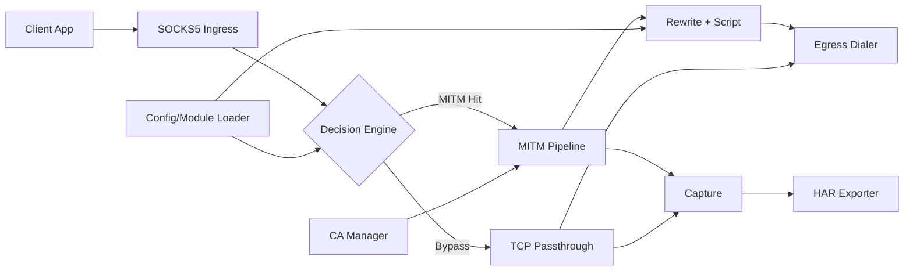

# GoMITM 开发规范（v1）

本文档用于指导后续开发，覆盖需求边界、架构分层、配置规范、性能与安全基线、里程碑和验收标准。

## 1. 目标与范围

### 1.1 项目目标
构建一个运行在类 Unix 系统上的高性能网络代理内核，具备以下能力：

1. SOCKS5 入口（主入口）。
2. 灵活出口路由（直连/上游代理/转中转）。
3. 按域名规则选择是否进行 HTTPS MITM。
4. 本地 Root CA 生成、保存、导出（供用户安装信任）。
5. 兼容 Surge/Shadowrocket 风格模块的核心能力（规则、URL 重写、脚本、MITM 主机列表）。
6. 抓包记录与导出 HAR（可被 Chrome/Charles/Fiddler/Postman 等工具导入）。

### 1.2 明确不做（v1 非目标）

1. 不做“全量” Surge 语法兼容，仅做可验证的子集兼容。
2. 不做 HTTP/3(QUIC) MITM（QUIC 默认旁路或按规则阻断 UDP 以回落 TCP）。
3. 不做 PCAP 伪造导出（应用层代理优先 HAR）。
4. 不做内核态透明代理（TProxy/iptables）首发支持，先完成显式代理模式。

## 2. 对原始方案的重设计结论

### 2.1 保留的合理点

1. Go 作为主语言（并发、网络库、跨平台编译优势明显）。
2. SNI 分流 + MITM/Passthrough 双路径。
3. 动态签发证书 + 证书缓存。
4. 抓包导出通用格式（HAR）。

### 2.2 修正的不合理点

1. `完全兼容 Surge 模块` 改为 `定义兼容子集`：避免项目初期复杂度失控。
2. `MITM + 脚本引擎全流量开启` 改为 `仅规则命中后进入解密与脚本链路`：保证性能。
3. `所有响应抓包存储` 改为 `按 Content-Type + 大小上限截断`：防止 OOM。
4. `JS 注入到客户端执行` 改为 `代理进程内置 JS 引擎执行`：这是原生 App 场景唯一可行路径。

## 3. 功能需求（MUST/SHOULD/MAY）

### 3.1 MUST（v1 必须）

1. SOCKS5 协议（RFC1928）CONNECT 支持。
2. TCP 443 场景下可提取 SNI 并按规则决策 MITM。
3. 本地 Root CA 首启生成（私钥 0600 权限），可导出 PEM/CRT。
4. 动态叶子证书签发（含 SAN），并做 LRU + singleflight 缓存。
5. MITM 域名规则：精确域名、后缀域名、通配符。
6. URL Rewrite：正则命中后支持 `reject`/`reject-200`。
7. Script：基于 goja 执行 HTTP 请求/响应脚本（含 body 访问）。
8. 抓包结构化记录与 HAR 导出。
9. 出口策略：DIRECT、HTTP 上游、SOCKS5 上游。
10. 配置热重载（原子切换，新连接生效）。

### 3.2 SHOULD（v1.1 建议）

1. UDP ASSOCIATE 支持（含域名/协议规则）。
2. Web 控制台（流量检索、规则命中、HAR 下载）。
3. 远程模块下载缓存（ETag/Last-Modified）。
4. 脚本执行超时与沙箱资源限制。

### 3.3 MAY（后续可选）

1. HTTP/2 细粒度控制。
2. 插件机制（Lua/WASM）。
3. OpenTelemetry 追踪。

## 4. 总体架构



## 5. 模块设计规范

### 5.1 Ingress（SOCKS5）

1. 监听 `tcp://<bind>:<port>`。
2. 首版支持 `NO AUTH`，预留用户名密码认证接口。
3. 每个连接生成 `conn_id`，贯穿日志、抓包、指标。

### 5.2 Decision Engine（分流决策）

决策输入：

1. SOCKS5 请求目标（host/ip:port）。
2. TCP 首包 TLS ClientHello（可提取 SNI 时优先使用）。
3. 规则库（MITM hostnames、路由规则、协议规则）。

决策输出：

1. `MITM`：进入 TLS 终结链路。
2. `BYPASS`：纯 TCP 转发（`io.Copy`）。
3. `REJECT`：主动拒绝。

### 5.3 CA Manager（证书中心）

1. 首启生成 Root CA：默认 `RSA-2048`（兼容性优先），可配置 ECDSA。
2. 文件布局：
   - `~/.gomitm/ca/root_ca.key`
   - `~/.gomitm/ca/root_ca.crt`
3. 提供 CLI：
   - `gomitm ca init`
   - `gomitm ca export --out ./gomitm-ca.crt`
4. 叶子证书缓存键：`hostname + key_type + validity_bucket`。
5. 证书有效期建议：Root 5-10 年，叶子 24-72 小时。

### 5.4 MITM Pipeline

1. 客户端侧 TLS：使用动态证书完成握手。
2. 服务端侧 TLS：按路由出口建立真实 TLS 连接。
3. 仅在命中 Rewrite/Script/Capture 规则时缓冲 body；否则流式转发。
4. 连接复用：启用 keep-alive；对上游连接池做 host 级复用。
5. MITM 后端通过 `MITMEngine` 接口抽象，`SOCKS5 主路径默认使用自研实现`；可选提供 `goproxy adapter` 作为 HTTP 代理模式扩展。

### 5.5 Rewrite + Script 引擎

1. JS 引擎采用 `goja`，使用 `sync.Pool` 复用运行时。
2. 脚本接口对象：`$request/$response/$done`（定义稳定字段子集）。
3. 脚本执行限制：
   - 超时（如 50~200ms，可配置）
   - 最大 body（如 2MB，超限跳过脚本）
4. 二进制模式：以 `Uint8Array` 映射 `[]byte`。

### 5.6 Capture + HAR Export

1. 记录内容：请求行、响应行、头、body（可截断）、时延、方向、规则命中信息。
2. 存储：
   - v1：内存环形缓冲区 + 可选落盘 JSONL。
   - v1.1：SQLite 索引存储。
3. 导出：按 HAR 1.2 规范生成 `.har`。
4. 脱敏：默认掩码 `Authorization/Cookie/Set-Cookie`。

### 5.7 Egress（出口）

统一 `DialContext` 抽象，支持：

1. `DIRECT`
2. `HTTP_PROXY`
3. `SOCKS5_PROXY`

路由选择可基于域名/IP/协议/进程标签（后续扩展）。

## 6. 配置规范（v1）

主配置建议为 YAML，模块文件支持 Surge-like 子集。

### 6.1 主配置示例

```yaml
listen:
  socks5: 0.0.0.0:1080

ca:
  dir: ~/.gomitm/ca
  key_type: rsa

mitm:
  enabled: true
  hostnames:
    - "*.googlevideo.com"
    - "youtubei.googleapis.com"

capture:
  enabled: true
  max_body_bytes: 2097152
  content_types:
    - application/json
    - text/*

egress:
  default: DIRECT
  proxies:
    hk_socks:
      type: SOCKS5_PROXY
      addr: 127.0.0.1:7891

modules:
  - url: https://raw.githubusercontent.com/iab0x00/ProxyRules/refs/heads/main/Rewrite/YouTubeNoAd.sgmodule
    enabled: true
```

### 6.2 Surge-like 兼容子集

支持：

1. `#!name #!desc #!arguments #!arguments-desc`
2. `[Rule]`：`DOMAIN`/`DOMAIN-SUFFIX` + `PROTOCOL` + `REJECT`
3. `[URL Rewrite]`：正则 + `reject`/`reject-200`
4. `[Script]`：`type=http-request/http-response`、`pattern`、`script-path`、`requires-body`、`binary-body-mode`、`max-size`、`argument`
5. `[MITM]`：`hostname = ...`

不支持（v1）：

1. 平台专有扩展字段。
2. 未定义行为的脚本全局变量。
3. 多级 include 的复杂模块组合语义。

## 7. 性能基线与容量目标

目标（单机参考，4C8G）：

1. Passthrough 吞吐优先，CPU 开销接近 `io.Copy` 基线。
2. MITM 场景下 P95 额外时延 < 20ms（无脚本）/ < 50ms（有脚本）。
3. 证书签发命中缓存后，握手开销显著下降。
4. 大文件下载不因抓包导致 OOM。

关键策略：

1. 非命中流量零额外解析。
2. 证书缓存 + singleflight 防击穿。
3. 脚本与抓包按规则激活，不全局开启。
4. 结构化日志异步写入，避免阻塞数据面。

## 8. 安全与合规要求

1. Root CA 私钥仅本地生成，不内置、不上传。
2. 私钥文件权限强制校验（0600）。
3. 默认关闭远程脚本任意联网能力（沙箱）。
4. 明确 UI/CLI 提示：MITM 仅用于合法授权场景。
5. 抓包导出支持脱敏配置，避免泄露凭据。

## 9. 代码组织建议

```text
cmd/gomitm/
  main.go
internal/
  ingress/socks5/
  decision/
  mitm/
  ca/
  rewrite/
  script/
  capture/
  har/
  egress/
  config/
  module/
pkg/
  rulematch/
  domainset/
  logx/
docs/
  ARCHITECTURE.zh-CN.md
```

## 10. 开发里程碑

> 状态说明（审视日期：2026-03-20）  
> `已完成`：功能已落地且有测试覆盖。  
> `进行中`：已部分落地，仍有明确待办。  
> `待开始`：尚未进入实现。

### M1（最小可用内核）- 已完成

1. SOCKS5 CONNECT + DIRECT 转发。
2. CA 生成/导出。
3. 按域名触发 MITM（无脚本）。
4. UDP ASSOCIATE relay（含基础策略拒绝）。
5. 基础安全默认值（loopback 监听策略）。

验收：浏览器可通过代理访问 HTTPS，命中域名可完成 MITM。

### M2（规则与脚本）- 已完成（持续增强）

1. Surge-like 子集解析。
2. URL Rewrite。
3. goja 脚本执行（请求/响应）。
4. 脚本执行超时与失败隔离。
5. Admin API 鉴权（Bearer Token）。
6. SOCKS5 用户认证（RFC1929）。

验收：可加载示例模块并命中脚本修改响应。

### M3（抓包与导出）- 已完成（持续增强）

1. 流量结构化记录。
2. HAR 导出接口/命令。
3. 大小限制与脱敏。
4. Header 脱敏 + 可选 JSON 字段脱敏。
5. 远程模块/脚本仅允许 HTTPS。

验收：导出的 HAR 可被 Chrome DevTools/Charles 打开。

### M4（性能与稳定性）- 进行中

1. 连接池与缓存调优。
2. 全局并发连接上限（`max_conns`）。
3. 压测与 pprof 分析。
4. 配置热重载与故障恢复。

验收：达到第 7 节性能目标并完成回归测试。

当前 M4 待办清单：

1. 配置热重载（SIGHUP 或管理接口触发，新连接生效）。
2. 压测报告沉淀（吞吐、P95、错误率、资源占用）。
3. 告警基线完善（当前已有 `/api/metrics`，需补规则与面板）。
4. 指标维度扩展（连接级限流、脚本超时等）。
5. 发布后灰度复盘模板固化（结合 Runbook）。

里程碑收口要求（新增）：

1. 每个里程碑完成后，必须同步评审并更新 `README.md`（功能、限制、配置字段、示例命令）。
2. 里程碑验收结论需在 PR 描述中给出“完成项/未完成项/风险项”三段式摘要。

## 11. 测试与验收规范

1. 单元测试：规则匹配、证书签发、脚本执行、HAR 序列化。
2. 集成测试：
   - SOCKS5 -> HTTPS -> MITM
   - Rewrite 拒绝策略
   - Script 二进制 body 改写
3. 压力测试：高并发 CONNECT、大文件旁路、脚本热点域名。
4. 安全测试：私钥权限、脚本超时、异常输入（模糊测试）。

## 12. GoProxy 依赖策略（关键决策）

### 12.1 结论

v1 采用 `主路径去依赖 + 可选包级复用`，不直接魔改源码。即：

1. `SOCKS5 主路径` 不把 GoProxy 作为核心 MITM 引擎。
2. `HTTP 代理兼容模式` 可通过适配层接入 `github.com/elazarl/goproxy`。

### 12.2 采用包级依赖的原因

1. GoProxy 的强项是 HTTP 代理 + CONNECT + MITM Hook，适合 HTTP 入口场景快速集成。
2. 本项目主入口是 SOCKS5，握手后是原始 TCP/TLS 流，不是 HTTP CONNECT，直接套用 GoProxy 主流程会产生协议模型错位。
3. 核心差异化在 SOCKS5 分流、模块规则、脚本与抓包，因此主数据面应保持可控并避免过度绑定第三方实现。

### 12.3 必须自研的部分（不交给 GoProxy）

1. SOCKS5 ingress 与连接生命周期管理。
2. SNI/规则决策与 MITM 命中逻辑。
3. Surge-like 配置解析、参数替换、模块管理。
4. JS 执行池、脚本沙箱、抓包存储与 HAR 导出。
5. 多出口路由策略与统一 Dialer。
6. SOCKS5 场景下的 TLS 终结、HTTP 解包与重封装。

### 12.4 触发“源码级改造或 fork”的条件

当出现以下任一条件，进入 fork 评估：

1. 仅在启用 HTTP 代理兼容模式时，遇到 GoProxy API 无法满足关键能力（上下文传递、性能、关键 Hook）。
2. 需要对 GoProxy 热路径做强约束改造且外部封装无法达成。
3. 发现阻断性 bug，且上游修复窗口不满足发布计划。

### 12.5 fork 管理规范（若触发）

1. 优先“最小补丁”策略，保持与上游可持续 rebase。
2. 补丁必须带基准测试与回归测试。
3. 所有改动先提上游 PR；未合入前在仓库维护 patch 清单。
4. 禁止在业务代码中直接调用 fork 私有符号，必须继续走 `MITMEngine` 适配层。

---

该规范作为 v1 基线，后续版本采用“兼容优先、逐步扩展”策略：先稳定数据面与核心 MITM，再扩大语法兼容范围。
